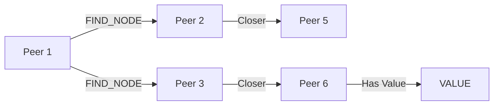

# Distributed Hash Table (DHT) in libp2p

## What is a DHT?
- A decentralized key-value storage system spread across network nodes
- Used for:
  - Peer discovery
  - Content routing
  - Storing records without central servers

## Key Concepts

### Distance Metric
- Uses XOR operation between keys and peer IDs
- Measures "logical distance" (not physical)
- Example: `distance(key1, peer9) = 4`

### Routing Table
- Each peer maintains:
  - Buckets of known peers
  - Organized by distance (closer peers = larger buckets)
- Helps find closer peers to any given key

## Core Operations

| Operation | Purpose |
|-----------|---------|
| `FIND_NODE` | Locate closest peers to a key |
| `PUT_VALUE` | Store key-value pair |
| `GET_VALUE` | Retrieve value by key |
| `ADD_PROVIDER` | Advertise content availability |
| `GET_PROVIDERS` | Find peers hosting content |

## How It Works

### Storing Data
1. Calculate key's distance to current peer
2. Find `k` closest peers to the key
3. Store value on those peers

### Retrieving Data
1. Ask closest known peers for the key
2. They return either:
   - The value (if they have it)
   - Closer peers to ask
3. Repeat until value found

### Content Advertising
- Special IPFS operations:
  - `ADD_PROVIDER`: "I have this content"
  - `GET_PROVIDERS`: "Who has this content?"

## Visual Example



## Key Properties
- Decentralized (no single point of failure)
- Efficient lookups (O(log n) hops)
- Self-organizing (peers join/leave automatically)

## Read More
- [Go Implementation](https://github.com/libp2p/go-libp2p-kad-dht)
- [Specification](https://github.com/libp2p/specs/tree/master/kad-dht)
```