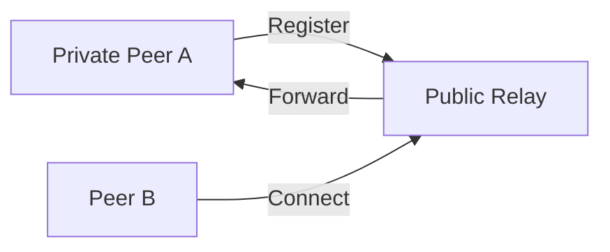

# libp2p NAT Traversal Guide

## The NAT Problem
- Home networks use private IPs (e.g., `192.168.1.2`)
- Only the router has a public IP
- Blocks direct P2P connections

## libp2p Solutions

### 1. Circuit Relay

- **How it works**:
  - Unreachable peers use public relays
  - Multiaddress format:  
    `/ip4/RELAY_IP/tcp/PORT/p2p/RELAY_ID/p2p-circuit/p2p/TARGET_ID`

### 2. Hole Punching
- **Direct connection through NAT/firewalls**
- **Types**:
  - **TCP Hole Punching**: Coordinate via third peer
  - **UDP Hole Punching**: Faster but less reliable

### 3. Project Flare (Future)
- Hybrid approach combining:
  - Relay fallback
  - Direct hole punching
- Solves scaling issues with pure relays

## Key Benefits
| Method | Latency | Bandwidth | Reliability |
|--------|---------|-----------|-------------|
| Relay | High | High | ✅ Excellent |
| Hole Punching | Low | Low | ⚠️ Moderate |

## Implementation Tips
1. **Enable relay in code**:
   ```go
   libp2p.EnableRelay()
   ```
2. **Test connectivity**:
   ```bash
   libp2p-diag ping /ip4/PEER_IP/tcp/...
   ```

## Resources
- [Circuit Relay Spec](https://github.com/libp2p/specs/blob/master/relay/README.md)
- [Hole Punching Docs](https://docs.libp2p.io/concepts/nat/)
```
